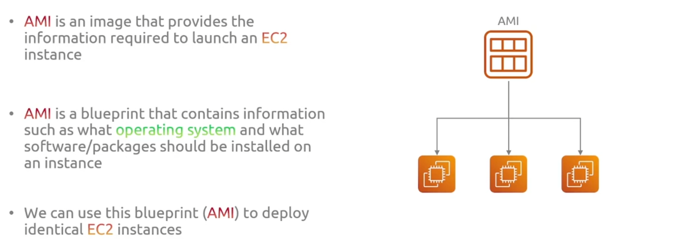
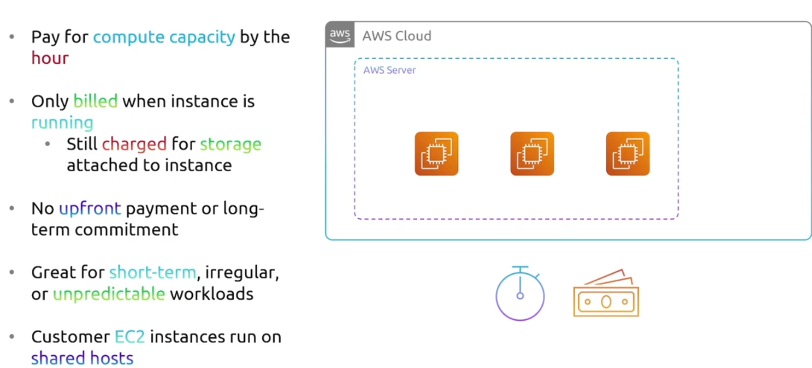

## EC2

### Amazon Machine Image

- AMI 是一种镜像，提供启动 EC2 实例所需的信息
- AMI 是一个蓝图，包含实例应安装的操作系统和软件/软件包等信息
- 我们可以使用该蓝图（AMI）部署相同的 EC2 实例
- 将 AMI 视为用于安装新服务器的安装盘
- AMI 可以完全定制，以便
  - 添加应用程序源代码
  - 添加依赖项
  - 自定义操作系统防火墙

### Instance Type

EC2 提供多种实例类型可供选择，并针对不同的使用情况进行了优化

实例类型具有不同的 CPU、内存、存储和网络容量组合

将实例类型视为可供选择的不同类型的服务器型号

+ General Purpose
  - 提供良好的计算、内存和网络资源平衡
  - 可用于各种工作负载
  - 是等比例使用资源的应用程序的理想选择
+ Compute Optimized
  - 针对计算量大的应用进行了优化
  - 包含高性能 CPU
  - 是批处理工作负载、媒体转码、机器学习和游戏服务器的理想选择

+ Memory Optimized

  为内存密集型工作负载提供快速性能。适合数据库

+ Storage Optimized

  针对请求对本地存储上的大型数据集进行高顺序读写访问的工作负载进行了优化
  可提供每秒数以万计的低延迟随机 I/O 操作 (IOPS)

+ Accelerated Computing

  利用硬件加速器执行昂贵的计算
  非常适合图形处理和数据模式匹配

### EC2 Pricing Options

+ On-Demand Pricing

  - 按小时支付计算能力
  - 仅在实例运行时计费
    - 实例附加存储仍需付费
  - 无需预付款或长期承诺
  - 非常适合短期、不规则或不可预测的工作负载
  - 客户 EC2 实例在共享主机上运行

  

+ Spot Pricing

  - 亚马逊以折扣价提供备用计算能力

  - 现货实例推荐用于
    - 开始和结束时间灵活的应用
    - 需要低计算价格的应用

  - 不适合无法忍受中断的工作负载

+ Reserve Pricing
  - 预订实例是一种计费折扣，可让您节省 EC2 费用
  - 在一定期限（1 年或 3 年合同）内保留时提供折扣价
  - 购买保留实例时，您实际上并没有购买实例
  - 您只是承诺长期使用一个按需实例
  - 当您部署与预订属性（实例类型、区域、平台）相匹配的按需实例时，将按照预订价格而不是默认价格收费

## Lambda

Lambda 的设计初衷就是让一切变得如此简单，您只需上传代码，然后 AWS 就会处理剩下的事情。这就是 Lambda 背后的主要思想。

AWS Lambda 是一项计算服务，可以让您运行代码而无需供应管理服务器。因此，您将代码复制到 aws，AWS 将管理底层基础设施，例如启动必要的 ec2实例

将代码复制到它们上，然后让它运行。这就是所谓的无服务器技术

Lambda 是 AWS 的无服务器产品。它管理服务器维护、扩展、容量调配和日志记录

### Lambda Use Cases

+ 图像处理

  这对于文件处理来说非常有用。假设我们有一个应用程序，允许用户将图像上传到 S3 存储桶。也许我们希望自动调整这些图像的大小以符合我们的 Web 应用程序。我们可以用 lambda 函数来处理这个问题，每次上传文件时都会触发，他们会抓取图像，调整其大小，然后将其重新上传到另一个 S3 存储桶。

+ 数据处理

  通过 Lambda 处理实时数据流。例如，使用 Amazon Kinesis 或 Amazon DynamoDB Streams 触发 Lambda 函数，对流式数据进行分析、转换或聚合，然后将结果存储到数据仓库或数据库中。

+ 定时任务

  利用 Amazon CloudWatch Events 定期触发 Lambda 函数执行计划任务，例如每天定时备份、清理旧数据或发送报告。

+ 自动化运维

**缺点：**

- 无本地状态
  - 需要单独的数据库来存储需要持久化的数据

- 执行时间有限
  - 函数最多只能运行 15 分钟
  - 不适合长时间运行的任务

- 冷启动
  - 由于初始化和加载函数需要时间，因此会发生冷启动
  - SnapStart 和调配并发性有助于减少冷启动

## Containers

### Elastic Container Service (ECS)

- 完全托管的容器编排服务，可帮助管理和扩展容器化应用程序
- ECS 由 AWS 管理
- 容器在 EC2 实例或 Fargate 上运行
- ECS 是专有软件（仅在 AWS 上提供）
- 迁移到其他云提供商将更加困难

### Elastic Kubernetes Service (EKS)

- AWS 弹性 Kubernetes 服务（EKS）是受管理的 Kubernetes 服务
  - EKS 为您管理控制平面
  - 用户仍负责管理工作节点
    - 除非他们决定使用 Fargate（AWS 将管理节点）