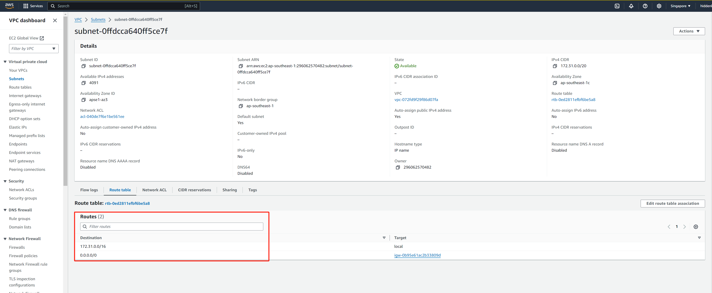
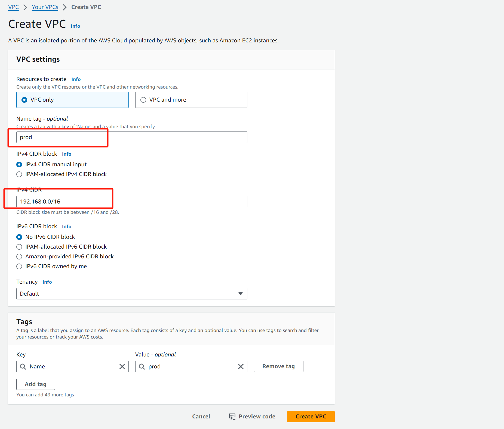
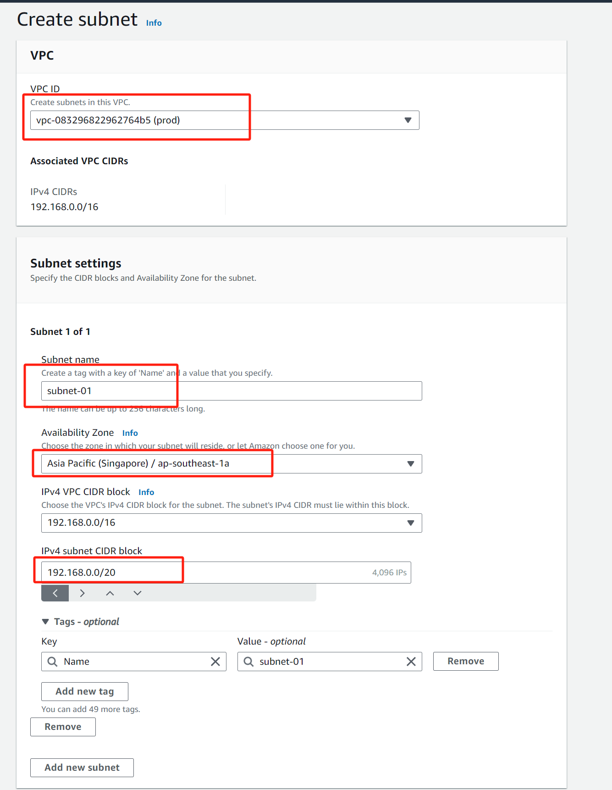
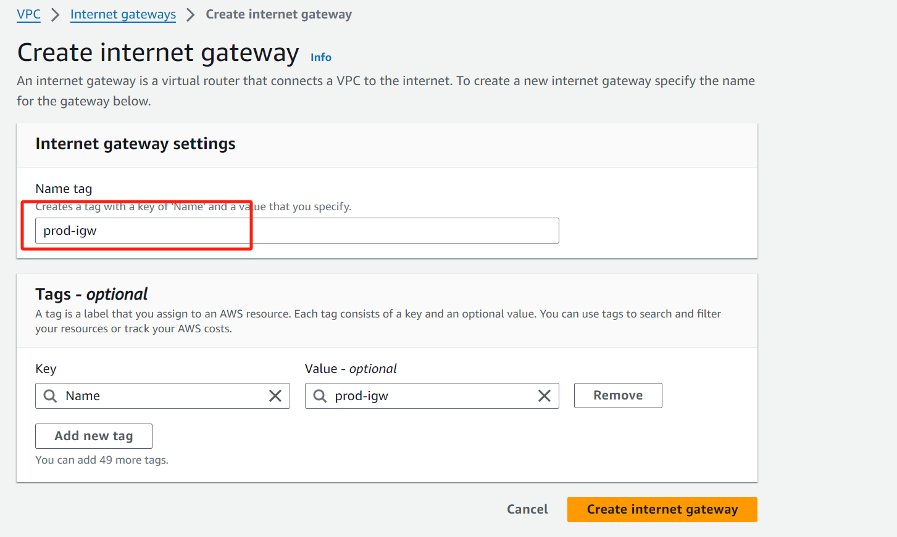
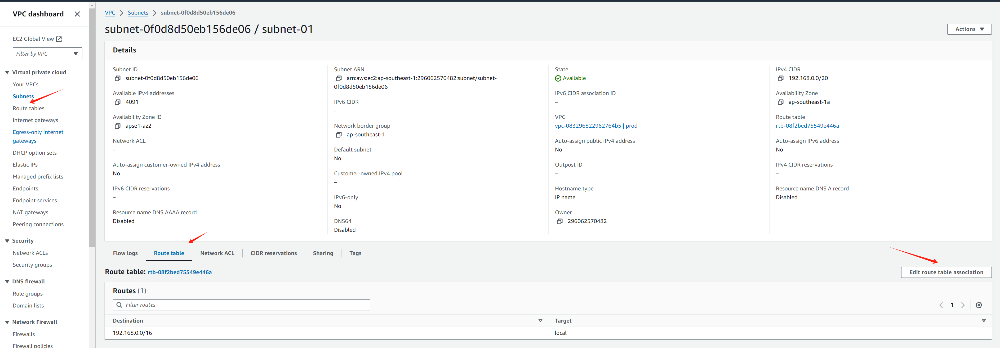
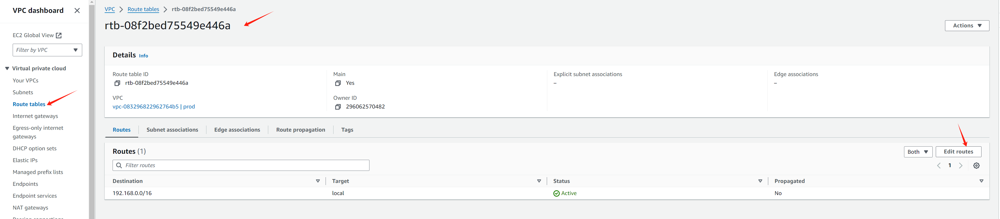
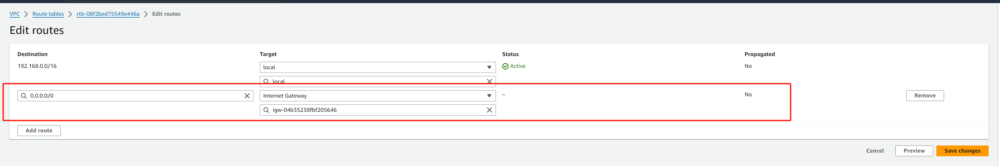
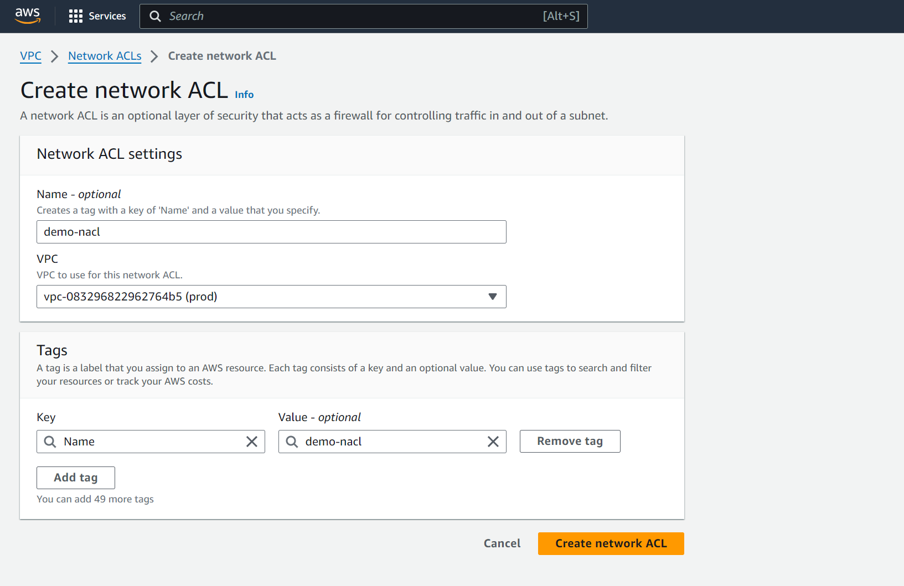
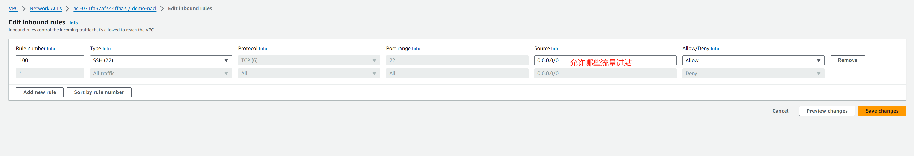
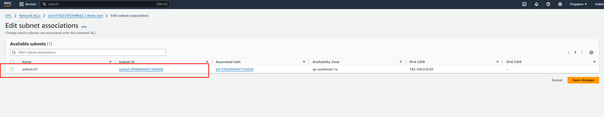

## Demo

默认的vpc概览

### 创建示例VPC

1. 

   其他信息保持默认

2. 创建subnet（已使要部署的资源放到其中）

   

   现在此子网中的资源是无法与互联网进行通信的，且互联网无法访问资源

3. 创建互联网网关

   

   

4. 为子网新增路由表，以使流量发送到互联网网关

   

   

   

   

**以上部分完成了将私有子网subnet-01转变为公有子网，接下来我们将确定哪些流量可以流量这些子网，然后我们再利用安全组，控制流向单个设备的流量**

5. 创建安全组

   

   

   创建入栈规则后，默认返回的流量是允许的

6. 创建NACL

   

   

   如果你想为哪几个子网使用此NACL

   

   

