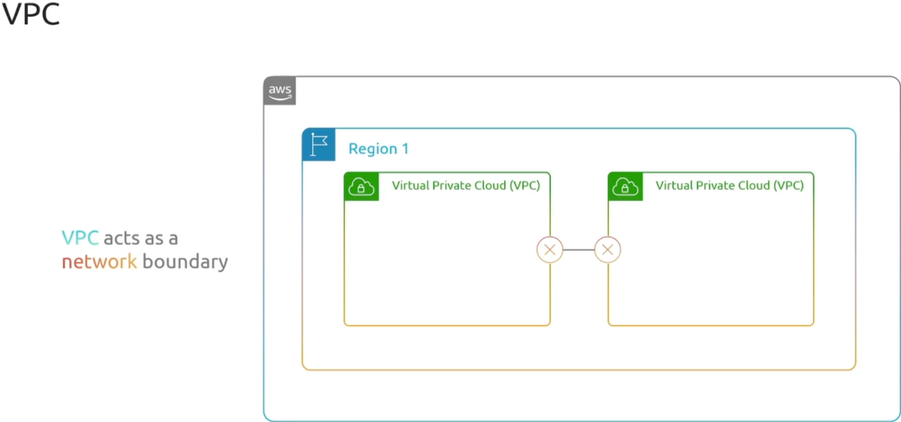
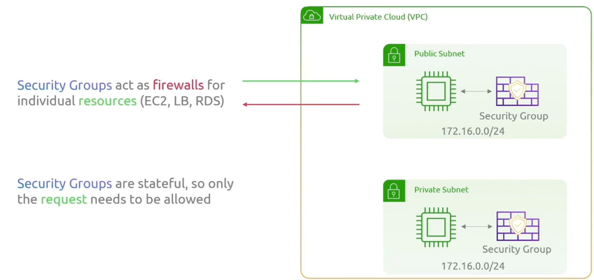

## VPC

每次您创建账户时，AWS都会自动在每个区域创建一个默认 VPC。

### Subnet

子网位于单个可用区内（例如子网1，子网2），在aws中创建服务器的时候，必须指定位于哪个子网.

创建子网时，可以是私有子网和公有子网

### Internet Gateway

### NAT Gateway

### Virtual Private Gateway（VPN Gateway)

### Direct Connect

## Default Vpcs

## Firewall

- NACL 监控进出子网的流量
- NACL 是无状态防火墙
  - 必须允许输入和输出方向的流量
- 安全组充当个人资源的防火墙
- 安全组是有状态的
  - 只需允许请求方向，响应也自动被允许

无状态的防火墙

有状态的防火墙

+ 他们跟踪了链接（哪个请求到哪个响应）
+ 如果请求被允许，那么响应也是放行的，也就是不需要出战规则

### Network Access Control List (NACL，无状态)

### Security Group(有状态)

## 总结

