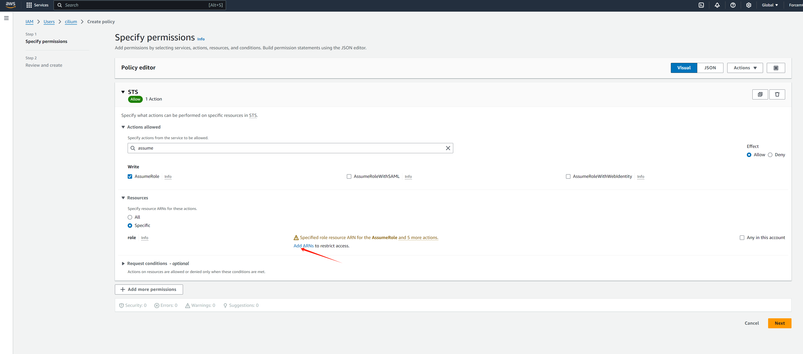
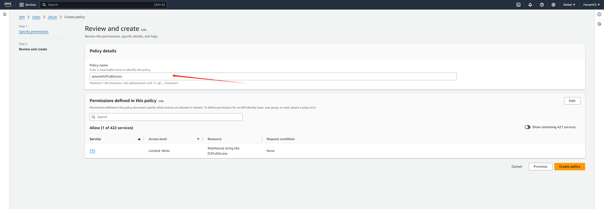
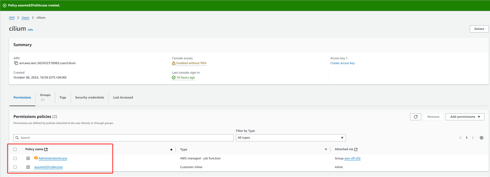
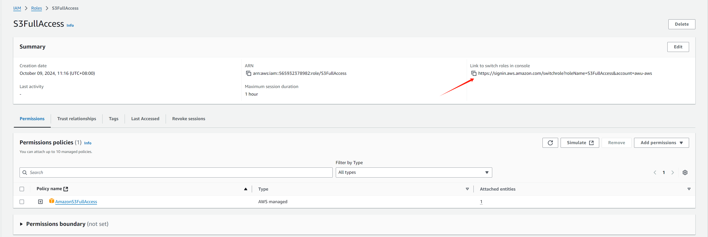
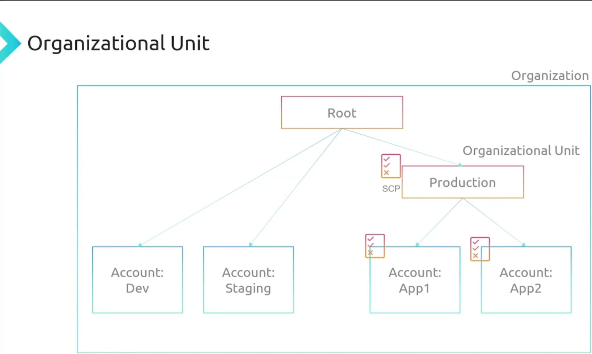
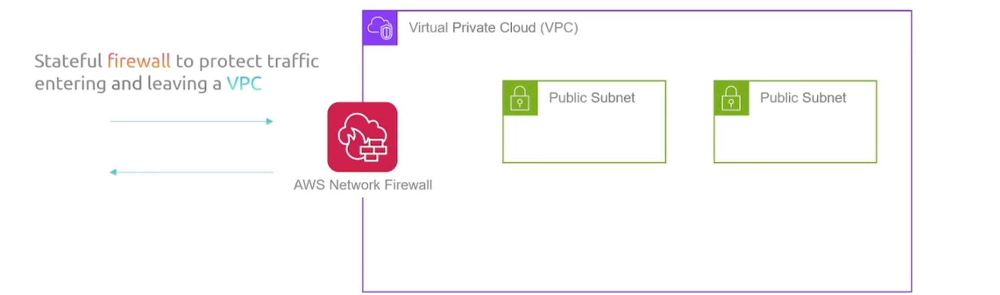
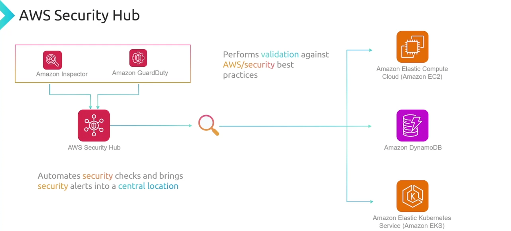
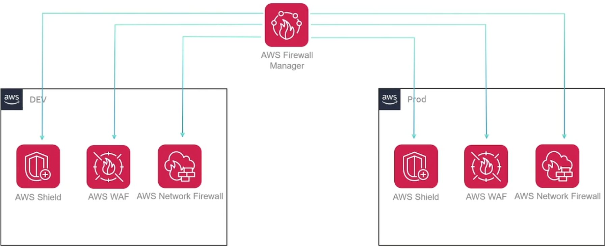
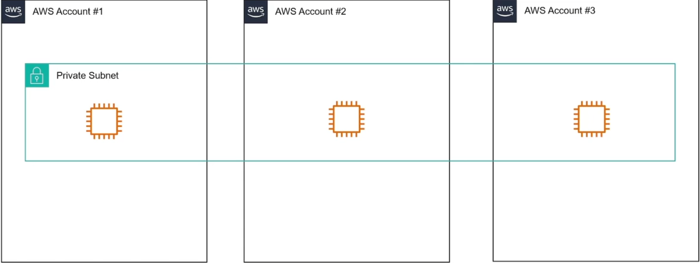
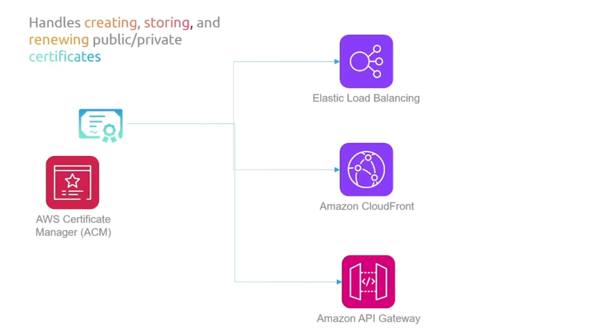

## IAM

分配用户权限有多种方法

1. 创建用户，并分配权限

2. 创建组，并分配权限，然后将没有权限的用户加入到组中

3. 创建Role（例如名为S3FullAccess），并分配权限，然后进入到用户（Add Permissions）选择 Create inline policy ,然后搜索STS服务，然后我们希望这个**内联策略**是将用户承担为Role，接下来的操作是关联到哪个Role(S3FullAccess)

   **Role的作用：**IAM 角色通常用于在 AWS 资源（例如 EC2 实例或 Lambda 函数）上运行的应用程序，以安全地访问其他 AWS 服务。通过将角色分配给这些资源，您可以定义每个角色的特定权限和访问持续时间，从而提供临时访问权限而无需暴露长期凭据。

   

   

   然后为这个policy起一个名字

   

此时用户所拥有的策略为

（可选）同时当我们点击Role（S3FullAccess）的时候，可以根据链接引导到控制台，执行相应的操作

## Service Control Policy

假设一个公司在 AWS Organizations 中有多个账户，其中一个账户用于开发环境 (Dev)，另一个用于生产环境 (Prod)。

- Dev 账户: 开发团队需要完全访问 Dev 环境的 S3 存储桶 "dev-bucket"，可以上传、下载、删除对象等。你可以创建一个 IAM 策略，授予对 "arn:aws:s3:::dev-bucket/*" 的完全访问权限，并将此策略附加到开发团队的 IAM 角色。

- Prod 账户: 生产环境的 S3 存储桶 "prod-bucket" 只允许读取数据，不允许写入或删除。你可以创建一个 IAM 策略，仅授予对 "arn:aws:s3:::prod-bucket/*" 的读取权限，并将此策略附加到运维团队的 IAM 角色。

为了满足合规性要求，公司规定组织的所有账户只能在 "us-east-1" 区域创建资源。这时就可以使用 SCP：

- 创建一个 SCP，拒绝所有账户在除 "us-east-1" 以外的区域创建任何资源。
- 将此 SCP 应用到 AWS Organizations 的根节点，这样所有成员账户都会受到限制。

**注意：**SCP的优先级是高于IAM的

将服务控制策略（**针对的是账号，不是用户**）应用于组织单位，然后该组织单位内的所有账户都将继承该服务控制策略

## AWS有关安全方面的资源

### Detection

+ WAF(Web Application Firewall) 

  WAF 位于您的 Web 应用程序之前，充当过滤器。当请求到达时，WAF 会根据您定义的规则对其进行评估。

+ Shield

  DDos攻击（目标被大量请求所淹没，导致应用程序或服务器不可用）

+ Network Firewall

  

+ Inspector

  可帮助您识别 AWS EC2 实例和应用程序中的安全漏洞以及与安全最佳实践的偏差

+ GuardDuty

  持续监控AWS上的基础设施，来识别威胁活动

+ Detective
  - 亚马逊 Detective 从 VPC 流日志、CloudTrail 日志和 GuardDuty 发现中获取数据。
  - Detective 使用机器学习和统计分析来创建高级可视化，显示资源行为和交互随时间的变化。

+ AWS Config

  跟踪并审核 AWS 资源的配置随时间的变化。

+ AWS Security Hub

  可以监控你的所有服务和资源，以执行AWS最佳实践

  

+ CloudTrail

  记录用户的活动信息，例如创建资源等

  可以记录用户身份验证事件，例如成功或失败的登录尝试，还可以记录 S3 存储桶对象级操作，例如对象上传、下载和删除。

+ Security Lake

  聚合日志信息（可以是第三方平台）

+ AWS Macie

  扫描铭感信息

**总结：**

1. GuardDuty 监控并检测您 AWS 环境中的可疑活动和潜在威胁。
2. Detective 帮助分析和调查与安全相关的事件，通过收集和可视化数据。
3. CloudTrail 记录并监控 AWS 账户内所有用户和 API 活动。
4. AWS Config 跟踪并审核 AWS 资源的配置随时间的变化。
5. Security Hub 自动化安全检查并将警报集中到一个位置，同时执行 AWS 最佳实践的验证。
6. Security Lake 从多个位置收集日志，并将其转换为查询高效的格式。

### Management

+ Firewall Manager

  防火墙管理器是一项安全管理服务，允许您集中配置和管理所有帐户的防火墙规则，以及应用程序

  

+ Resource Access Manager

  资源访问管理器的作用是帮助您安全地跨帐户、组织和组织单位共享资源。

  

+ AWS Cognito
  -  Cognito 帮助实现移动和 Web 应用程序的客户身份和访问管理。
  - 易于向任何应用程序添加注册和登录功能，而无需社交身份验证。
  - Cognito 管理所有用户凭证。

+ IAM Identity Center

  可以在一个地方管理所有用户，然后授予他们访问您所有不同帐户的权限。它使得工作更容易，而不是在每个独立的帐户上独立管理用户

+ Secret Manager
  - 应用程序需要访问各种凭据/秘密以执行多种任务。
    - 您不希望在应用程序源代码中硬编码凭据。
  - 凭据可以存储和管理在 AWS Secrets Manager 中。
  - 应用程序动态地从 Secrets Manager 中提取秘密。
  - 使用 Secrets Manager，您可以为您的秘密配置自动轮换计划。

+ AWS Certificate Manager (ACM)

  处理public/private 证书的创建、存储和更新

  

+ AWS Private Certificate Authority

  创建私人 CA 以管理组织内私人证书的简便方法

+ KMS

  创建和管理用于加密数据的加密密钥。

+ CloudHSM

  AWS 提供专用硬件来存储和操作加密密钥

  
