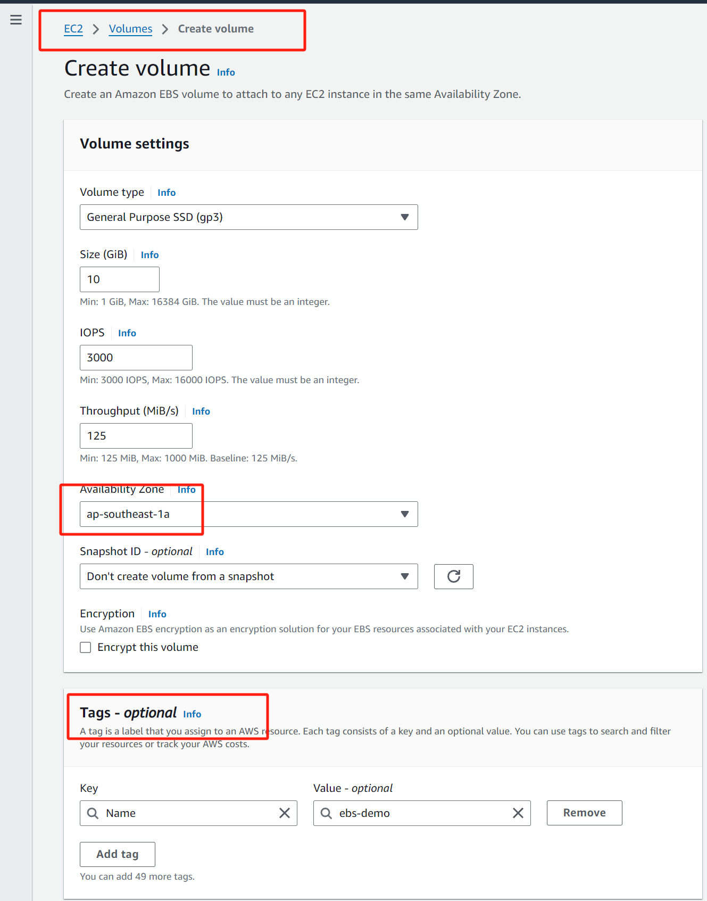
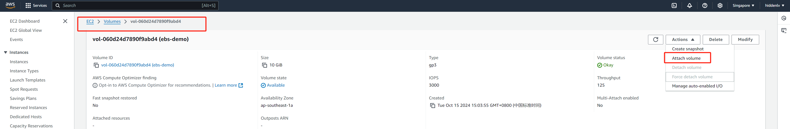
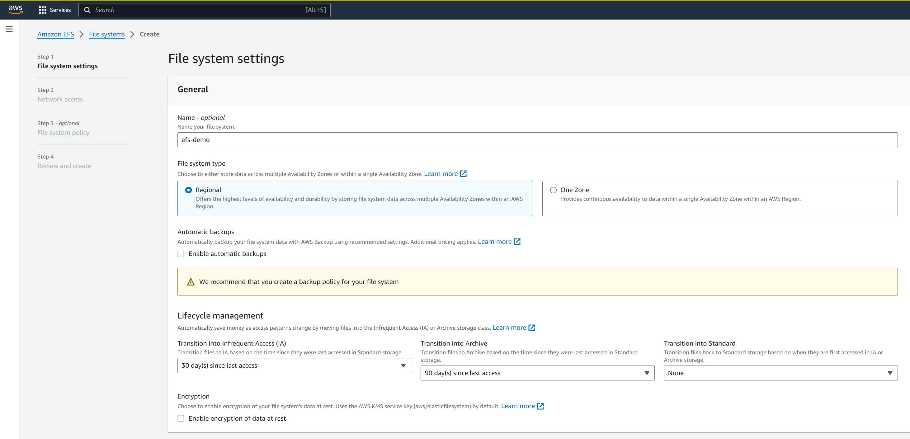
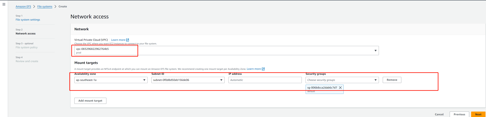

## 演示

### EBS

1. 创建ebs(要为哪个zone创建)

   

2. 将其附加到两个EC2实例

   

3. 登录到ec2,创建文件系统并挂载

   ```shell
   ubuntu@ip-172-31-81-106:~$ lsblk  
   NAME   MAJ:MIN RM   SIZE RO TYPE MOUNTPOINTS  
   loop0    7:0    0  24.4M  1 loop /snap/amazon-ssm-agent/6312  
   xvda   202:0    0   8.0G  0 disk   
   xvda1  202:1    0     4M  0 part /boot/efi  
   xvdf   202:80   0    20G  0 disk   
   
   ubuntu@ip-172-31-81-106:~$ sudo file -s /dev/xvdf  
   /dev/xvdf: data  
   
   ubuntu@ip-172-31-81-106:~$ sudo mkfs.  
   mkfs.bfs     mkfs.cramfs  mkfs.ext3    mkfs.fat     mkfs.msdos   mkfs.vfat  
   mkfs.btrfs   mkfs.ext2    mkfs.minix   mkfs.ntfs    mkfs.xfs     mkfs.ext4 /dev/xvdf  
   
   mke2fs 1.46.5 (30-Dec-2021)  
   Creating filesystem with 5242880 4k blocks and 1310720 inodes  
   Filesystem UUID: d00f00f3-51b6-4669-acb0-363989469b91  
   Superblock backups stored on blocks:  
    32768, 98304, 163840, 229376, 294912, 819200, 884736, 1605632, 2654208, 4096000  
   
   Allocating group tables: done  
   Writing inode tables: done  
   Creating journal (32768 blocks): done  
   Writing superblocks and filesystem accounting information: done  
   
   ubuntu@ip-172-31-81-106:~$ sudo mount /dev/xvdf /ebsdemo 
   ubuntu@ip-172-31-81-106:~$ ls /dev/xvdf  
   bin   boot  ebsdemo  etc  lib   lib64  lost+found  mnt  proc  run  snap  sys  usr  opt  root  sbin  srv  tmp  var
   #然后进行持久化
   ubuntu@ip-172-31-81-106:~$ cd /ebsdemo/
   ubuntu@ip-172-31-81-106:/ebsdemo$ sudo blkid
   /dev/xvdal: LABEL="cloudimg-rootfs" UUID="cda0c0a7-e64a-4413-85a5-a0235f6f567f" BLOCK_SIZE="4096" TYPE="ext4" PARTUUID="b2e4a171-bfec-43f0-928d-f8fe4f326f17"
   /dev/xvda15: LABEL_FATBOOT="UEFI" LABEL="UEFI" UUID="54D6-C8B8" BLOCK_SIZE="512" TYPE="vfat" PARTUUID="abfe16f0-dfd7-479d-93a7-67821caab591"
   /dev/xvda14: PARTUUID="95e367f7-7ab6-484b-ac14-66a7518b75ba"
   ubuntu@ip-172-31-81-106:/ebsdemo$ sudo vi /etc/fstab
   LABEL=cloudimg-rootfs /        ext4    discard,errors=remount-ro  0 1  
   LABEL=UEFI          /boot/efi  vfat    umask=0077              0 1  
   UUID=d00f00f3-51b6-4669-acb0-36398946b9b1 /ebsdemo ext4 defaults 0 0 
   ```

4. 这个ebs-demo并为绑定到之前的ec2中，只是附加到ec2中，当我们停止ec2 demo-1，这个EBS ebs-demo就可以执行**Detach volume的Actions**

   然后我们可以将其附加到ec2 demo-2中，此时的这个ebs已经有了文件系统了，可以将其挂在了任何想要的路径中

   **NOTE:**假设ec2 demo-1中在此ebs中生成了数据，那么ec2 demo-2同样可以看到相同的数据

### EFS

1. 创建efs

   可以这个efs暴露给这个vpc下的多个可用区

   

2. 假如我们使用的是amazon操作系统

   ```shell
   #连接到ec2实例
   #apt  install -y amazon-efs-utils
   [ec2-user@ip-172-31-88-238 /]$ sudo mkdir /efsdemo
   [ec2-user@ip-172-31-88-238 /]$ sudo mount.
   mount.efs mount.nfs4
   [ec2-user@ip-172-31-88-238 /]$ sudo mount.efs instance-id-efs /efsdemo
   [ec2-user@ip-172-31-88-238 /]$ sudo mount.efs fs-02f4d38ba0c8c36aa /efsdemo
   [ec2-user@ip-172-31-88-238 /]$ df -h
   Filesystem           Size  Used Avail Use% Mounted on
   devtmpfs             4.0M     0  4.0M   0% /dev
   tmpfs                477M     0  477M   0% /dev/shm
   tmpfs                191M  2.8M  188M   2% /run
   /dev/xvda1           8.0G  1.6G  6.5G  20% /
   tmpfs                477M     0  477M   0% /tmp
   fs-02f4d38ba0c8c36aa.efs.us-east-1.amazonaws.com:/  8.0E  0.0E  8.0E   0% /efsdemo
   [ec2-user@ip-172-31-88-238 /]$ sudo vim /etc/fstab
   UUID=d0c265c4-6ea1-4060-b815-520e1c2aae05 /                       xfs     defaults,noatime      1 1  
   UUID=606C-CF35       /boot/efi               vfat    defaults,noatime,uid=0,gid=0,umask=0077,shortname=winnt,x-systemd.automount  0 2  
   fs-02f4d38ba0c8c36aa:/efsdemo efs _netdev,noresvport,tls,iam 0 0  具体的参数请参考aws efs文档
   ```

   现在我们登录到另一台EC2中，使用mount.efs fs-02f4d38ba0c8c36aa /xxx,相当于这个efs在两台ec2之间实现了共享

### S3
1. 创建存储桶，启用acl
2. iam 创建用户，并创建相应的策略（例如对于特定的存储桶下的所有内容具有get put权限），并常见access key
   
