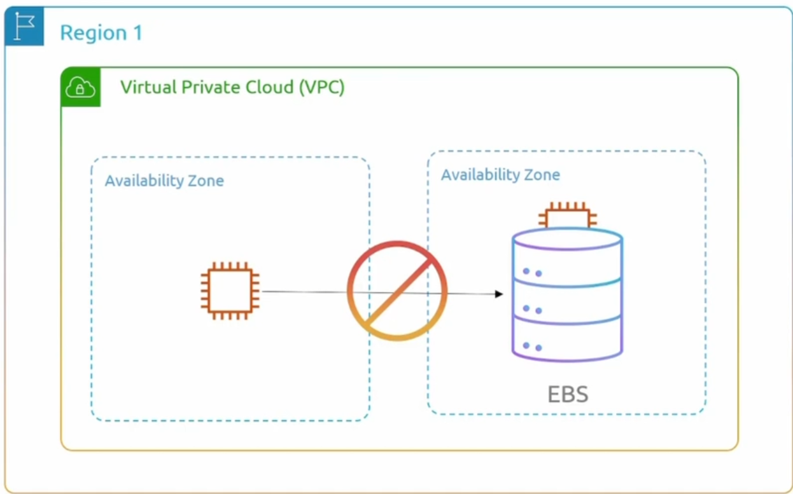
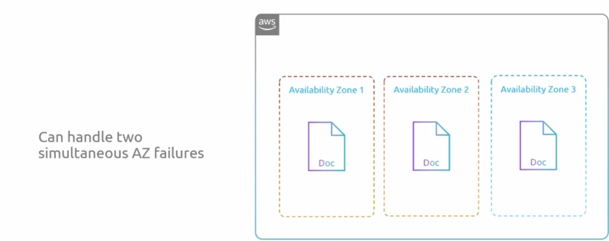
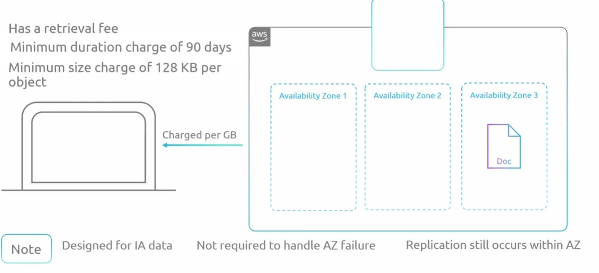
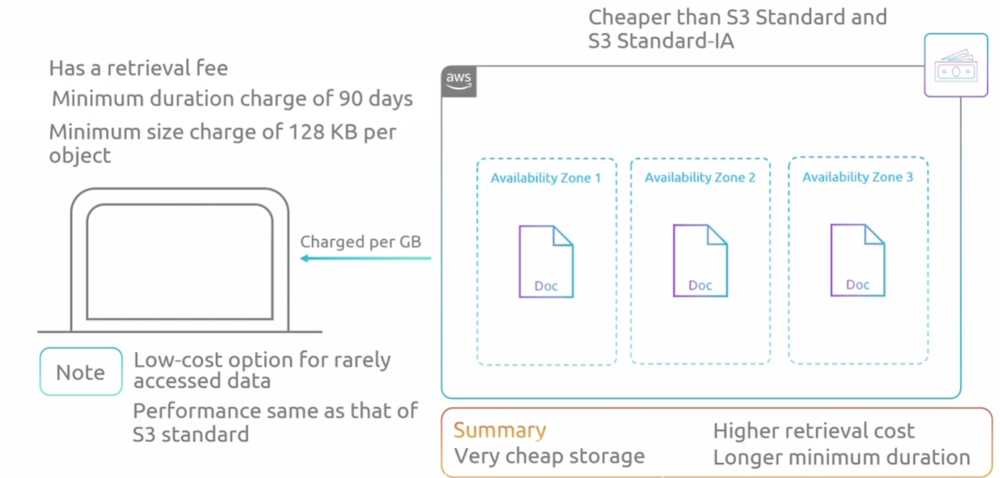
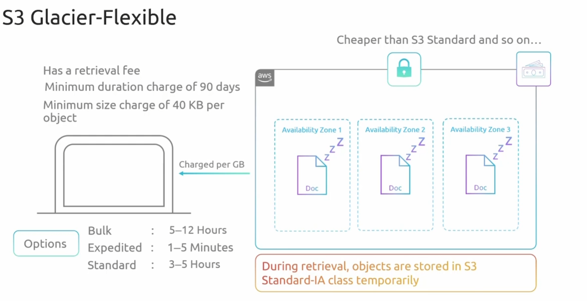
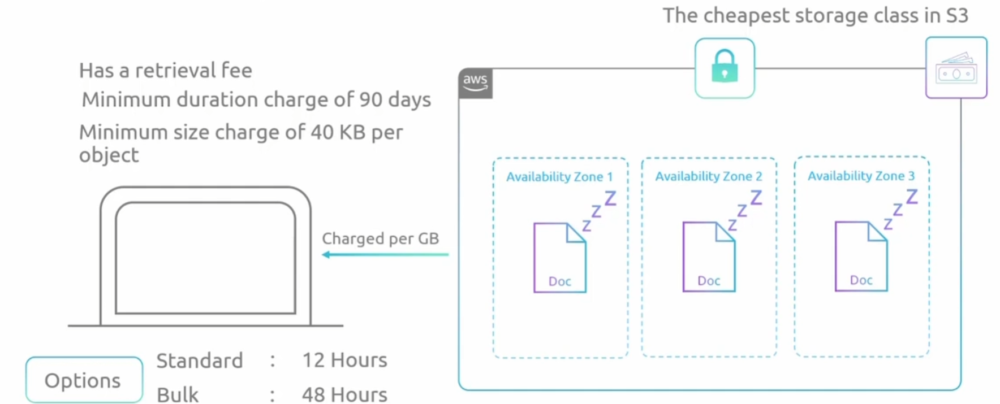
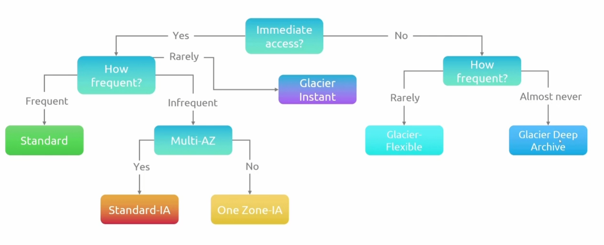

## Elastic Block Storage

**EBS和其中要使用它的资源必须在同一个Zone中**

- 块存储将数据分割成块，然后将这些块存储为单独的片段，每个片段都有唯一的标识符

- 区块的集合可以作为卷提交给操作系统
  - 操作系统在其上创建文件系统

- 区块的集合可以作为硬盘来展示
  - 块存储是可启动的，这意味着可以在其上安装操作系统

## Elastic File System

文件存储 - 以文件和文件夹的分层结构存储数据
- 与电脑存储文件/文件夹的方式类似
- 可远程访问的文件系统
  - 创建子目录
  - 在其中存储和访问文件
- 可挂载文件存储
- 不可启动，因此无法安装操作系统

- 可通过网络访问文件存储
- 多个客户端可访问同一数据

## S3 - Object Storage

对象存储无法用于挂载或者有引导，在平面文件结构中。 S3非常适合存储媒体文件、日志、审计报告，基本上可以存储您想要的任何类型的文件

- 对象存储 - 存储对象
  - 对象只不过是文件
  - 可存储任何类型的文件

- 没有文件夹结构
  - 扁平文件结构 - 所有文件都在同一个文件夹中

- 由于没有文件夹结构，对象存储无法加载或启动

- 非常适合存储日志和媒体文件

### Storage Class

+ standard(default)

  + 可同时处理两个 AZ 故障

    

+ standard-IA

  不需要频繁的访问存储数据，但是如果频繁的访问数据，那么比 上边的一张是更贵的

  同时默认是需要支付90天的费用的

+ One Zone-IA

  与上边的IA一致，只是只有一个可用区

  

+ S3 Glacier-Instant
  + 针对很少访问的数据的低成本选择
  + 性能与 S3  default相同
  + 比 S3 default和 S3 Standard-IA 便宜

+ S3 Glacier-Flexible

  + 有取回费用
  + 最短期限收费 90 天
  + 每个对象最小收费 40 KB
  + 检索时，对象暂时存储在 S3 Standard-IA 类中

  

+ S3 Glacier Deep Archive

  

### 如何选用存储类

